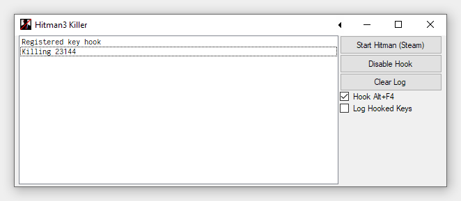

# HITMAN3 Killer

Utility for Freelancer mode speedruns. Kills HITMAN3 process via hotkey (<key>Right Ctrl</key>+<key>K</key>) or standard <key>Alt</key>+<key>F4</key> when enabled—only targets `HITMAN3.exe` processes, and only hooks/handles input when `HITMAN3.exe` window is active.

## TODO

- Option for killing HITMAN3 regardless of current active window
  
- Configurable hotkey combo

- Better name/ui